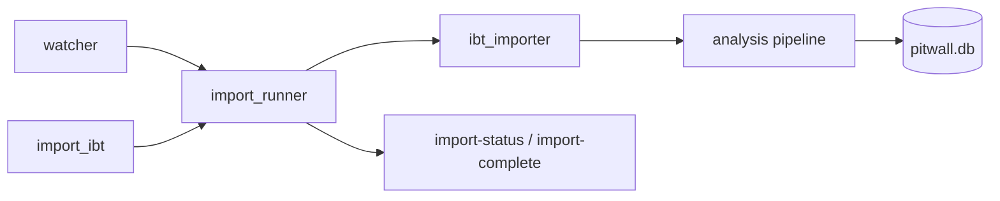

# Post-session analysis

Imported IBT files flow through segmentation, sector splitting, fuel/tire aggregation, SQLite storage, and rule-based (plus optional LLM) coaching.

---

## Import flow

| Step | Module | Notes |
|------|--------|-------|
| File detect | `ingest/watcher.rs` | `notify` on telemetry folder, create events |
| Single-flight | `import_runner.rs` | `import_gate` mutex; progress events |
| Parse | `ibt_importer.rs` | `pitwall` crate, SHA256 dedup |
| Frames | `frame_extractor.rs` | Pre-resolved variable offsets |

---

## Analysis pipeline

[`analysis/pipeline.rs`](../src-tauri/src/analysis/pipeline.rs) orchestrates:

1. **Lap segmenter** — splits frames into laps per sub-session (P/Q/R)
2. **Sector splitter** — YAML boundaries; ignores sector 0 at 0%; always S3
3. **Lap kind** — [`lap_kind.rs`](../src-tauri/src/analysis/lap_kind.rs): `flying`, `pitOut`, `pitIn`, `pitLane`, `partial`
4. **Fuel / tire** — per-lap aggregates
5. **Traces** — downsampled speed/throttle/brake for compare chart

---

## Rule-based coach

[`analysis/coach.rs`](../src-tauri/src/analysis/coach.rs) — deterministic insights from SQLite:

| Kind | Logic |
|------|-------|
| `consistency` | Std dev of valid lap times |
| `sector_weakness` | Avg sector loss vs best lap (>50 ms) per S1–S3 |
| `fuel` | Last lap fuel > 115% of session average |
| `session_pace` | Your best vs session fastest (linked standings) |
| `traffic_pace` | Slow laps (>500 ms off best) that were in traffic |

[`trace_coach.rs`](../src-tauri/src/analysis/trace_coach.rs) adds trace insights (early lift, late brake, high steering) when compare traces exist.

`get_coach_report` merges rule insights + trace + standings when available.

---

## Ollama layer

[`coach/llm.rs`](../src-tauri/src/coach/llm.rs) — POST to `{ollamaUrl}/api/generate` with lap stats and insight bullets. **No raw IBT.** Fails gracefully offline.

`generate_coach_summary` command wraps this for the Analyze tab.

---

## Dedup and lap numbering

- IBT dedup by SHA256 + path
- Laps keyed by `(session_id, session_num, lap_number)` — sub-session aware
- `iracing_lap` preserved for traffic-lap correlation with live standings

---

## Related docs

- [DATA_MODEL.md](DATA_MODEL.md) — schema
- [FEATURES.md](FEATURES.md) — Analyze tab walkthrough
- [API.md](API.md) — `get_coach_report`, `generate_coach_summary`
