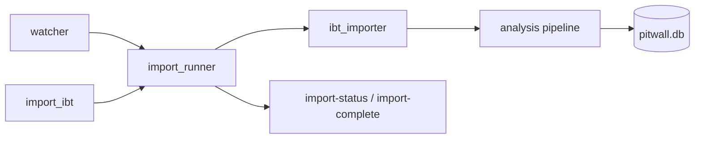

# Post-session analysis

Imported IBT files flow through segmentation, sector splitting, fuel/tire aggregation,
lap cleanup, SQLite storage, and deterministic Analyze insights.

---

## Import flow

```mermaid
flowchart LR
  Watcher[watcher] --> Runner[import_runner]
  Manual[import_ibt] --> Runner
  Runner --> Importer[ibt_importer]
  Importer --> Pipeline[analysis pipeline]
  Pipeline --> DB[(pitwall.db)]
  Runner --> Events[import-status / import-complete]
```

| Step | Module | Notes |
|------|--------|-------|
| File detect | `ingest/watcher.rs` | `notify` on telemetry folder, create events |
| Single-flight | `import_runner.rs` | `import_gate` mutex; progress events |
| Parse | `ibt_importer.rs` | `pitwall` crate; identity key = path+size+mtime |
| Frames | `frame_extractor.rs` | Pre-resolved offsets; tire channels optional (`*tempM` → `*tempCM`) |

Skip of an already-imported file returns the **existing** `session_id` and still emits `import-complete`.

---

## Analysis pipeline

[`analysis/pipeline.rs`](../src-tauri/src/analysis/pipeline.rs) orchestrates:

1. **Lap segmenter** — splits on `(SessionNum, Lap)`; official time + `_OK` flags sampled on the next lap's first frame
2. **Sector splitter** — YAML boundaries; ignores sector 0 at 0%; no equal-thirds invention
3. **Fuel / tire** — per-lap aggregates
4. **Traces** — downsampled speed/throttle/brake/gear/steering for compare
5. **Cleanup** — [`analysis/cleanup.rs`](../src-tauri/src/analysis/cleanup.rs) (`finalize_analyzed_laps`)

### Lap cleanup (A / B / C)

iRacing often leaves `LapLastLapTime` unchanged across tow/reset fragments and emits
`Lap == 0` buckets with no distance. Before persist (and again when loading older
sessions for display), PitWall applies:

| Rule | Behavior |
|------|----------|
| **A — Phantoms** | Drop laps with `iracing_lap == 0` and near-zero distance (`max pct < 0.01`), then renumber 1..N per sub-session |
| **B — Sticky times** | If a lap’s time matches the last *kept* time and the lap is incomplete or not both-`_OK`, clear `lap_time_ms` |
| **C — Coverage** | Pace eligibility requires near-full distance (`lap_dist_pct_max ≥ 0.95`) in addition to an official time and both `_OK` flags |

`paceEligible` / session `best_lap_ms` use that rule. Read path cleanup in
[`storage/db.rs`](../src-tauri/src/storage/db.rs) updates list/detail summaries without
rewriting SQLite rows; reimport persists cleaned values.

---

## Analyze insights

Deterministic bullets from imported laps: consistency (stdev), weak sector, fuel outlier.
Computed on the Analyze page from your session data.

---

## Related docs

- [DATA_MODEL.md](DATA_MODEL.md) — schema v2
- [FEATURES.md](FEATURES.md) — Analyze tab
- [API.md](API.md) — session/compare/import commands
