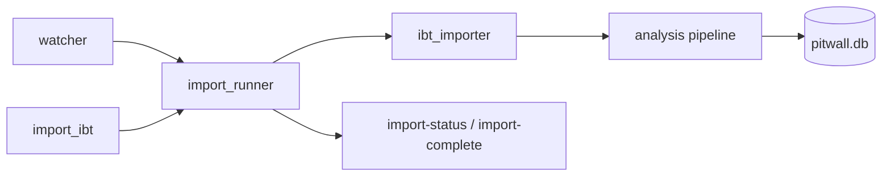

# Post-session analysis

Imported IBT files flow through segmentation, sector splitting, fuel/tire aggregation,
lap cleanup, SQLite storage, and deterministic Analyze insights.

---

## Import flow

```mermaid
flowchart LR
  Watcher[watcher] --> Runner[import_runner]
  Manual[import_ibt] --> Runner
  Runner --> Importer[ibt_importer]
  Importer --> Pipeline[analysis pipeline]
  Pipeline --> DB[(pitwall.db)]
  Runner --> Events[import-status / import-complete]
```

| Step | Module | Notes |
|------|--------|-------|
| File detect | `ingest/watcher.rs` | `notify` on telemetry folder, create events |
| Single-flight | `import_runner.rs` | `import_gate` mutex; progress events |
| Parse | `ibt_importer.rs` | `pitwall` crate; identity key = path+size+mtime |
| Frames | `frame_extractor.rs` | Pre-resolved offsets; tire channels optional (`*tempM` → `*tempCM`) |

Skip of an already-imported file returns the **existing** `session_id` and still emits `import-complete`.

---

## Analysis pipeline

[`analysis/pipeline.rs`](../src-tauri/src/analysis/pipeline.rs) orchestrates:

1. **Lap segmenter** — splits on `(SessionNum, Lap)`; official time + `_OK` flags sampled on the next lap's first frame
2. **Sector splitter** — YAML boundaries; ignores sector 0 at 0%; no equal-thirds invention
3. **Fuel / tire** — per-lap aggregates
4. **Traces** — every 6th frame (~10 Hz from a 60 Hz IBT): speed/throttle/brake/gear/steering, plus GPS (`lat`/`lon`), `elapsed_ms`, and raw pedal channels when present (see [DATA_MODEL.md](DATA_MODEL.md))
5. **Cleanup** — [`analysis/cleanup.rs`](../src-tauri/src/analysis/cleanup.rs) (`finalize_analyzed_laps`)

Applied pedals (`Throttle` / `Brake`) stay on the charts; `ThrottleRaw` / `BrakeRaw` (schema v5) are stored for driver-intent consumers and fall back to applied when missing.

### Lap cleanup (A / B / C)

iRacing often leaves `LapLastLapTime` unchanged across tow/reset fragments and emits
`Lap == 0` buckets with no distance. Before persist (and again when loading older
sessions for display), PitWall applies:

| Rule | Behavior |
|------|----------|
| **A — Phantoms** | Drop laps with `iracing_lap == 0` and near-zero distance (`max pct < 0.01`), then renumber 1..N per sub-session |
| **B — Sticky times** | If a lap’s time matches the last *kept* time and the lap is incomplete or not both-`_OK`, clear `lap_time_ms` |
| **C — Coverage** | Pace eligibility requires near-full distance (`lap_dist_pct_max ≥ 0.95`) in addition to an official time and both `_OK` flags |

`paceEligible` / session `best_lap_ms` use that rule. Read path cleanup in
[`storage/db.rs`](../src-tauri/src/storage/db.rs) updates list/detail summaries without
rewriting SQLite rows; reimport persists cleaned values.

---

## Analyze insights

Deterministic bullets from imported laps: consistency (stdev), weak sector, fuel outlier.
Computed on the Analyze page from your session data.

---

## Lap compare and corners

[`compare.rs`](../crates/pitwall-analysis/src/compare.rs) aligns two laps on a 200-point
distance grid; [`corners.rs`](../crates/pitwall-analysis/src/corners.rs) adds timing.

- **Time curve** ΓÇö each lap's elapsed time vs lap distance. Uses the recorded
  `elapsed_ms` trace channel (schema v4) when present; otherwise speed is integrated over
  distance and scaled to the official lap time (`timing: "estimated"`). On real laps the
  estimate is within ~150 ms per corner; re-import for exact numbers.
- **Running delta** ΓÇö `cumulativeDeltaMs` on each aligned point: candidate minus
  reference, zero where both laps' coverage starts. Its end value matches the official
  lap delta.
- **Corners** ΓÇö found on the reference lap's smoothed speed: a slow-down and pick-up of at
  least max(2.5 m/s, 6%). Each corner runs from the speed peak before it to the peak after
  it (the first/last corner extend to the range ends), so corner deltas sum to the lap gap.
  Numbering is in track order and may not match official turn numbers.
- **Per corner** ΓÇö time delta split at the reference apex (entry / exit), each lap's
  minimum speed, brake-point delta (first brake ≥ 10%) and full-throttle delta (first
  throttle ≥ 90% after the lap's own slowest point) in metres. Metres use the track length
  implied by the reference lap's speed and time.
- **Driver vs applied pedals** ΓÇö brake and throttle pickup read the driver's pedals
  (`ThrottleRaw` / `BrakeRaw`, schema v5) so a downshift auto-blip or ABS release doesn't
  move them; sessions imported before v5 fall back to applied `Throttle` / `Brake`. The
  throttle and brake **charts** stay on applied values, so blips and TC/ABS
  intervention remain visible there.

### Driver aids (ABS / TC)

`LapComparison.assists` lists where either lap's aids intervened, on a 1000-step grid
across the compared range. Runs separated by at most 2 samples are merged; runs shorter
than 3 samples are dropped.

| Aid | Signal | Missing when |
|-----|--------|--------------|
| ABS | `BrakeABSactive` (schema v6) | Imported before v6 |
| TC | Driver throttle (`ThrottleRaw`) more than 5% above applied while on throttle | Imported before v5 |

ABS uses only the sim's own flag. On a car without driver aids, the raw/applied brake and
throttle gaps never opened, and we haven't confirmed that applied `Brake` drops under ABS,
so a brake gap isn't used as a fallback. Auto-blips push applied throttle *above* raw, so
they never count as TC.

### Corner technique

Each `CornerDelta` carries a `CornerTechnique` for both laps, measured on that lap's own
timeline with driver pedals:

| Field | Meaning |
|-------|---------|
| `absMs` / `tcMs` | Time with the aid active in the corner segment |
| `peakBrake` | Highest brake before the reference apex (`null` if under 10%) |
| `trailBrakeMs` | From the last sample at ≥ 90% of peak brake to brake below 10% |
| `coastMs` | Time with both pedals at or below 5% |
| `apexToThrottleMs` | From the lap's own slowest point to full throttle (≥ 90%); `null` when taken flat |

### Brake-point consistency

[`consistency.rs`](../crates/pitwall-analysis/src/consistency.rs) (`corner_consistency`)
finds corners on the reference lap's full range, then for each given lap records the brake
point relative to the reference (metres, positive = later), the corner time delta, and
minimum speed. `brakeSpreadM` is the sample standard deviation of brake offsets. Corners
running to the start/finish line clamp to the distance both laps cover. The UI passes
complete, non-pit laps from the reference's sub-session, matches entries to comparison
corners by nearest apex (within 1% of the lap), and hides laps that lost more than 3 s in
a corner (spins, offs) so the scatter stays readable.

---

## Related docs

- [DATA_MODEL.md](DATA_MODEL.md) — schema v6
- [FEATURES.md](FEATURES.md) — Analyze tab
- [API.md](API.md) — session/compare/import commands

