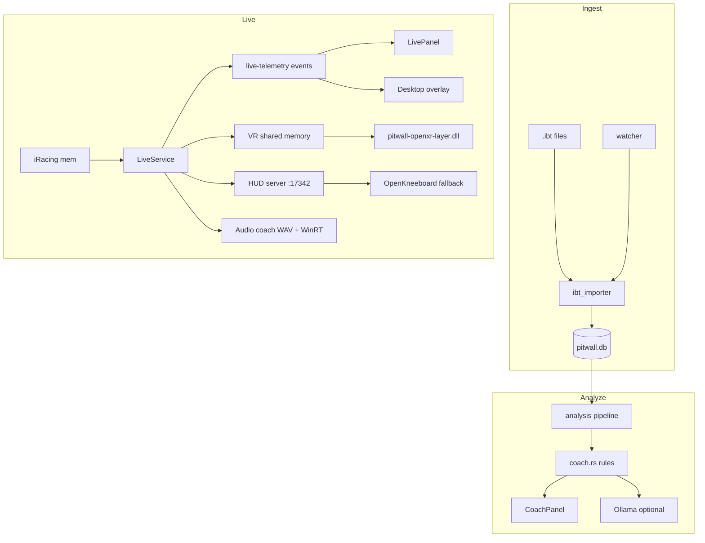

# PitWall Desktop — Architecture & Audit

Last audited: June 23, 2026. Version **0.1.0**.

This document describes how the project is structured, how data flows through it, and what is implemented vs planned. **Documentation hub:** [README.md](README.md). **IPC detail:** [API.md](API.md).

---

## Overview

PitWall Desktop is a **Tauri 2** application: a Rust backend (`src-tauri/`) exposes IPC commands and events to a **React** frontend (`src/`). Post-session work uses **SQLite**; live work uses the **pitwall** crate's shared-memory connection to iRacing.



---

## Repository layout

```
pitwall-desktop/
├── docs/
│   ├── README.md                # Documentation hub
│   ├── ARCHITECTURE.md          # This file
│   ├── API.md                   # IPC reference + docs:api
│   └── …                        # Area deep-dives
├── src/                         # React frontend
│   ├── main.tsx                 # Main window entry
│   ├── overlay.tsx              # Overlay window entry
│   ├── App.tsx                  # Analyze | Live tabs
│   ├── components/              # UI panels
│   └── lib/                     # api.ts, types.ts
├── src-tauri/
│   ├── src/                     # Rust modules (see below)
│   ├── capabilities/            # Tauri IPC permissions per window
│   ├── tauri.conf.json
│   └── Cargo.toml               # vr-overlay feature flag
├── index.html                   # Main Vite entry
├── overlay.html                 # Overlay Vite entry
├── vite.config.ts               # Multi-page build
├── setup.ps1                    # First-run setup script
└── package.json
```

---

## Rust backend modules

| Module | Path | Responsibility |
|--------|------|----------------|
| `commands` | `commands/mod.rs` | `AppState`, all Tauri IPC handlers |
| `ingest` | `ingest/` | IBT import, watcher, `app.ini` check |
| `analysis` | `analysis/` | Lap segmentation, sectors, fuel/tire, coach rules, `lap_kind` |
| `storage` | `storage/` | SQLite schema, models, queries |
| `live` | `live/` | `LiveService`, snapshots, sector tracking, competitor leaderboard, pack state, standings persistence |
| `coach` | `coach/` | Ollama HTTP client for AI summaries |
| `settings` | `settings/` | `settings.json` load/save |
| `overlay` | `overlay/` | Desktop `live-overlay` Tauri window |
| `vr` | `vr/` | In-headset HUD: native OpenXR layer (`shm.rs`, `layer_install.rs`, `openxr-layer/`) + HTTP server fallback (`hud_server.rs`) |
| `audio` | `audio/` | Path B coach: `speech`, `queue`, `player`, `manifest`, `tts_winrt`, `clip_phrases`, `coach` — see [AUDIO_COACH.md](AUDIO_COACH.md) |

### Ingest pipeline

1. **Watcher** (`watcher.rs`) — `notify` on `Documents/iRacing/telemetry/`, `Create` events only.
2. **Import runner** (`import_runner.rs`) — single-import mutex, progress events, `spawn_blocking` for DB writes.
3. **IBT importer** (`ibt_importer.rs`) — parses via `pitwall`, SHA256 dedup, calls analysis pipeline.
4. **Frame extractor** (`frame_extractor.rs`) — pre-resolved variable offsets for IBT frames.
5. **Config check** (`config_check.rs`) — validates `irsdkEnableMem`, `irsdkEnableDisk`, telemetry dir.

### Analysis pipeline

1. **Lap segmenter** — splits frames into laps; downsamples trace points for charts.
2. **Sector splitter** — uses iRacing sector boundaries; ignores sector 0 at 0%; always computes S3.
3. **Fuel/tire** — per-lap aggregates.
4. **Coach** (`coach.rs`) — deterministic insights from DB data (see [Coach engine](#coach-engine)).

### Live pipeline

1. `Pitwall::connect().await` — shared memory connection.
2. Subscribe to `AnalysisFrame` at `UpdateRate::Max(10)` (player) **and** `CarIdxFrame` at `UpdateRate::Max(4)` (all cars + session-wide state).
3. `session_updates()` stream — track/car name, sector boundaries, and the driver roster (`competitors::build_roster`) from session YAML.
4. `LiveTracker` — lap boundaries, sector **edge crossings** ([LIVE_TELEMETRY.md](LIVE_TELEMETRY.md)); holds roster and player car index.
5. `merge_car_idx` — folds the latest `CarIdxFrame` into the snapshot: leaderboard (`competitors.rs`), positions, gaps, session deltas, pack state (`pack.rs`), flags, incidents, fuel/session remain.
6. Per-lap traffic logging — laps run side-by-side (`pack_state.is_traffic()`) are accumulated for the standings snapshot.
7. Emit `live-telemetry` + `live-status` every **100 ms** (10 Hz UI throttle).
8. On disconnect — `persist_standings` writes a `session_standings` row (final field + traffic laps), later linked to an imported IBT by track + recency.

---

## Frontend

### Entry points

| HTML | TS entry | Window |
|------|----------|--------|
| `index.html` | `main.tsx` | Main (`Analyze` / `Live` tabs) |
| `overlay.html` | `overlay.tsx` | `live-overlay` (created at runtime) |

### Components

| Component | Role |
|-----------|------|
| `SessionBrowser` | Session list, import/scan/clear DB |
| `LapTable` | Laps with sectors; select 2 for compare; coach highlight |
| `LapCompareChart` | Speed/throttle/brake traces (Recharts) |
| `FuelTirePanel` | Fuel and tire charts |
| `CoachPanel` | Rule insights (incl. field pace / traffic) + Ollama summary button |
| `SessionStandingsPanel` | Read-only standings snapshot for the session, when a live snapshot is linked |
| `SessionLeaderboard` | Live leaderboard with overall/class toggle |
| `ConfigBanner` | `app.ini` warnings; "Start live monitor" CTA |
| `LivePanel` | Live controls, metrics, leaderboard, overlay/VR/audio toggles |
| `OverlayView` | Draggable multi-widget shell for the pop-out window (`src/widgets/`) |
| `CoachWidget`, `StandingsWidget`, `RelativeWidget`, `RadarWidget` | Shared overlay renderers in `src/widgets/` (desktop + visual reference for VR) |

### API layer (`src/lib/api.ts`)

- `invoke()` wrappers for every Tauri command.
- Event listeners: `onImportComplete`, `onImportStatus`, `onLiveTelemetry`, `onLiveStatus`.
- Format helpers: `formatLapTime`, `formatDelta`, `formatDate`.

TypeScript types in `src/lib/types.ts` mirror Rust `serde` structs (`camelCase`).

---

## IPC reference

**37 commands** and **4 events** — full tables, TypeScript wrappers, and generated rustdoc/TypeDoc instructions: **[API.md](API.md)**.

Summary:

- **Sessions / analysis** — list, get, traces, fuel, tire, coach report, standings, Ollama summary
- **Import** — IBT path, folder scan, config check, status, picker, clear DB (debug)
- **Live** — start/stop monitor, status, snapshot
- **Settings** — get/save `AppSettings`
- **Overlays** — desktop window, VR native/web, layer install, audio coach

Events: `import-status`, `import-complete`, `live-telemetry` (~10 Hz), `live-status`.

### Tauri capabilities

| File | Windows | Permissions |
|------|---------|-------------|
| `capabilities/default.json` | `main` | `core:default`, `dialog:default` |
| `capabilities/overlay.json` | `live-overlay` | `core:default` |

---

## Data model

### SQLite — `%LOCALAPPDATA%\pitwall-desktop\pitwall.db`

**PRAGMA:** `journal_mode=WAL`, `synchronous=NORMAL`

#### `sessions`

| Column | Type | Notes |
|--------|------|-------|
| `id` | INTEGER PK | |
| `ibt_path` | TEXT UNIQUE | Full path to source IBT |
| `file_hash` | TEXT | SHA256 for dedup |
| `track`, `car` | TEXT | From session YAML |
| `session_date` | TEXT | ISO |
| `lap_count` | INTEGER | |
| `best_lap_ms` | REAL | |
| `imported_at` | TEXT | ISO |

#### `laps`

| Column | Type | Notes |
|--------|------|-------|
| `id` | INTEGER PK | |
| `session_id` | FK → sessions | CASCADE delete |
| `session_num` | INTEGER | iRacing sub-session (P/Q/R) |
| `session_type` | TEXT | e.g. "PRACTICE" |
| `iracing_lap` | INTEGER | Raw iRacing lap counter |
| `lap_number` | INTEGER | Sequential within sub-session |
| `lap_time_ms` | REAL | |
| `valid` | INTEGER | 0/1 |
| `lap_kind` | TEXT | `flying`, `pitOut`, `pitIn`, `pitLane`, `partial` |
| `fuel_start`, `fuel_used` | REAL | |
| `avg_speed` | REAL | |
| `lf_temp`, `rf_temp`, `lr_temp`, `rr_temp` | REAL | Lap averages |

**UNIQUE:** `(session_id, session_num, lap_number)`

#### `sectors`

| Column | Type |
|--------|------|
| `lap_id` | FK → laps |
| `sector_num` | INTEGER (1–3) |
| `time_ms` | REAL |

**UNIQUE:** `(lap_id, sector_num)`

#### `lap_traces`

Downsampled points for compare chart: `dist_pct`, `speed`, `throttle`, `brake`, `gear`, `steering`.

#### `session_standings`

Post-session snapshot of the live field, captured on live disconnect and linked to an imported IBT by track + recency.

| Column | Type | Notes |
|--------|------|-------|
| `id` | INTEGER PK | |
| `session_id` | FK → sessions | Nullable; `ON DELETE SET NULL` |
| `track`, `session_type`, `session_date` | TEXT | |
| `session_fastest_ms`, `player_best_ms` | REAL | |
| `player_position`, `player_class_position` | INTEGER | |
| `competitors_json` | TEXT | Leaderboard rows (position, best lap, class) |
| `traffic_laps_json` | TEXT | iRacing lap numbers run side-by-side |
| `created_at` | TEXT | ISO |

### Settings — `%LOCALAPPDATA%\pitwall-desktop\settings.json`

Full field list: [DATA_MODEL.md](DATA_MODEL.md). Example (abbreviated):

```json
{
  "ollamaUrl": "http://localhost:11434",
  "ollamaModel": "llama3.2",
  "vrMode": "native",
  "overlayLayout": { "fieldPaceMode": "best", "widgets": [/* 4 slots */] },
  "audioCoachEnabled": true,
  "audioCoachChatterLevel": "normal",
  "audioPackAlertsEnabled": true,
  "audioFlagsEnabled": true,
  "audioGapAlertsEnabled": true,
  "audioPaceEnabled": true,
  "audioStrategyEnabled": true,
  "audioRaceClockEnabled": true
}
```

---

## Coach engine

Rule-based insights (`analysis/coach.rs`) — no GPU, runs on imported SQLite data:

| Insight kind | Logic |
|--------------|-------|
| `consistency` | Std dev of valid lap times |
| `sector_weakness` | Per sub-session: avg sector loss vs best lap (>50 ms), per S1–S3 |
| `fuel` | Last lap fuel > 115% of session average |
| `session_pace` | Your best lap vs the session's fastest (from a linked standings snapshot) |
| `traffic_pace` | Slow laps (>500 ms off best) that were also run in traffic |

**Not yet implemented** (listed in v2 plan but absent from code):

- Throttle/brake anomaly detection from trace compare
- Per-stage consistency breakdown (uses all valid laps globally)

### Ollama layer (`coach/llm.rs`)

Sends a text prompt with lap stats + insight bullets — **not** raw IBT. POST to `{ollamaUrl}/api/generate`. Fails gracefully if Ollama is offline.

---

## Overlay architecture

### Desktop (Phase 3A)

- Tauri `WebviewWindowBuilder` → label `live-overlay`, `overlay.html`.
- Always-on-top, transparent, undecorated.
- Subscribes to `live-telemetry` events (same as Live panel).
- Window position/size from `settings.json`; **persisted on close** via `overlay/desktop.rs` window event handler.
- Renders the shared widget catalog (`src/widgets/`): the enabled set and field
  pace come from `settings.overlay_layout` — the same config the VR compositor
  reads. Each widget is dragged/resized in-window and its desktop pixel
  placement persists per widget; VR placement (height/scale/opacity) is stored
  separately on the same widget.

### VR / in-headset (Phase 3B + native VR)

PitWall renders in VR two ways, selected by `settings.vr_mode`:

**Native (default).** PitWall's own OpenXR API layer composites the HUD in the
headset — no OpenKneeboard, RaceLab, or SteamVR overlay.

- `vr/shm.rs` writes a compact `LiveSnapshot` mirror + per-overlay placement into
  the named shared-memory block `Local\PitWallVR` at ~30 Hz under a seqlock.
- The C++ layer in `openxr-layer/` hooks `xrEndFrame`, reads the block, draws each
  enabled widget (coach, standings, relative, radar) with Direct2D/DirectWrite,
  and appends one `XrCompositionLayerQuad` per slot.
- `vr/layer_install.rs` registers the layer manifest under
  `HKCU\Software\Khronos\OpenXR\1\ApiLayers\Implicit`.
- Four fixed overlay slots (index = widget kind) share one `overlay_layout` in
  settings with the desktop pop-out.
- Full details: [NATIVE_VR.md](NATIVE_VR.md).

**Web fallback.** Local HTTP server on `http://127.0.0.1:17342/vr`
(`vr/hud_server.rs`) serves a self-contained HTML HUD that polls `/api/live`;
the user adds the URL as a **Web Dashboard** tab in OpenKneeboard. The same page
is the browser preview and the visual reference the Direct2D renderer mirrors.

**HUD content:** position (class · overall), gap ahead/behind, spotter pack
indicator, lap time, Δ best, Δ last, field pace (session best / optimal, per
setting), sector progress, fuel, speed, and a flag badge when a flag is raised.

**Why a native layer?** See [VR_NATIVE_SPIKE.md](VR_NATIVE_SPIKE.md) for the
research. `XR_EXTX_overlay` is unsupported on consumer runtimes, so the native
path is an implicit OpenXR API layer hooking `xrEndFrame` — the June 2026 no-go
was reversed on product direction to replace RaceLab VR.

### Audio coach (Phase 3C — Path B)

**Summary:** Pre-recorded WAV clips + Windows WinRT for dynamic numbers. No neural runtime in the app.

Full pipeline, message catalog, and clip export: **[AUDIO_COACH.md](AUDIO_COACH.md)**.

- `CoachEngine::poll` every **250 ms** → `SpeechQueue` → `AudioPlayer` (rodio + WinRT)
- Priority model, pit/off-track suppression, session modes (practice/qual/race)
- Gaps, race clock, pits open, position changes, chatter level + per-category toggles
- Auto-start when `audioCoachEnabled` and live monitor starts

---

## Build configuration

### Cargo features

Native VR uses shared memory (`vr/shm.rs`); the web fallback HTTP server
(`vr/hud_server.rs`) is compiled in all builds but only started when
`vrMode` is `"web"`.

### Vite (`vite.config.ts`)

- Dev server port **1420** (strict).
- Multi-page: `index.html` + `overlay.html`.
- Ignores `src-tauri/**` from file watching.

### Key dependencies

| Crate / package | Role |
|-----------------|------|
| `pitwall` 0.1 | IBT + live SDK |
| `rayon` | Parallel analysis |
| `rusqlite` | SQLite |
| `notify` | File watcher |
| `reqwest` | Ollama |
| `rodio` | WAV playback |
| `tts_winrt` (in-tree) | WinRT speech synthesis |
| `recharts` | Frontend charts |

---

## Audit findings

### Implemented (v2 plan)

| Item | Status |
|------|--------|
| Live panel + 10 Hz events | Done |
| `start/stop_live_monitor` | Done |
| Rule-based coach + UI | Done |
| Ollama summary | Done |
| Desktop overlay | Done |
| VR in-headset HUD | Done — native OpenXR layer (default) + OpenKneeboard web fallback |
| Audio hybrid coach (Path B) | Done — WAV + WinRT; see [AUDIO_COACH.md](AUDIO_COACH.md) |
| Config banner live CTA | Done |
| Sub-session lap segmentation | Done (v1 fix) |
| Sector splitter fix | Done (v1 fix) |

### Implemented (v3 roadmap)

| Item | Status |
|------|--------|
| Trace-based coach (`trace_coach.rs`) | Done — early lift, late brake, high steering |
| Live reconnect + backoff | Done — `Reconnecting` state |
| Post-session IBT import on live disconnect | Done — scans last 10 min |
| GitHub Actions CI | Done — `.github/workflows/ci.yml` |
| Overlay position persist on close | Done |
| App version in header | Done |
| VR native spike doc | Done — [VR_NATIVE_SPIKE.md](VR_NATIVE_SPIKE.md); no-go later reversed |
| Native OpenXR layer (coach HUD) | Done — `openxr-layer/`, `vr/shm.rs`, [NATIVE_VR.md](NATIVE_VR.md) |
| Spotter pack `CarLeftRight` Int32 fix | Done — `car_idx_frame.rs` reads Int32, not BitField |

### Implemented (v4 — multi-driver comparison)

| Item | Status |
|------|--------|
| Live leaderboard (overall/class) | Done — `competitors.rs`, `SessionLeaderboard.tsx` |
| Session best/optimal deltas | Done — `LapDeltaToSessionBestLap` / `…OptimalLap` |
| Gaps ahead/behind | Done — `CarIdxF2Time` differences (validate vs live) |
| Spotter pack state | Done — `pack.rs` from `CarLeftRight` |
| VR HUD field context | Done — position, gaps, field delta, pack line |
| Audio priority queue + suppression | Done — `audio/coach.rs` |
| Flags / incidents / race-fuel audio | Done — edge-triggered, per-category toggles |
| Standings snapshot on disconnect | Done — `session_standings` table, IBT link |
| `session_pace` / `traffic_pace` coach | Done — `analysis/coach.rs` |
| Post-session standings UI | Done — `SessionStandingsPanel.tsx` |
| Multi-driver docs | Done — [COMPARISON.md](COMPARISON.md) |

### Implemented (v5 — Path B audio + docs hub)

| Item | Status |
|------|--------|
| WAV clip manifest + WinRT dynamic speech | Done |
| `gen-audio-clips` dev export | Done |
| Gaps, race clock, pits open, session modes | Done |
| Live sector edge crossing + mid-lap join | Done |
| `lap_kind` classification | Done |
| Documentation hub + API reference | Done — [README.md](README.md), [API.md](API.md) |

### Gaps / limitations

| Item | Detail |
|------|--------|
| Native OpenXR API layer | Coach + standings + relative + radar widgets — see [NATIVE_VR.md](NATIVE_VR.md) |
| Unified overlay widgets (desktop + VR) | Done — `overlay_layout` in settings, `src/widgets/` |
| OpenVR / SteamVR path | Removed — user request |
| OpenKneeboard for VR | Now optional fallback only; native layer is the default |
| MoTeC export | Out of scope, not started |
| Multi-car analysis | Out of scope, not started |
| Real-time LLM coaching | Out of scope |
| `clear_database_cmd` | Debug builds only |
| Single import at a time | `import_gate` mutex |
| Lap compare | UI limited to 2 laps |
| Tire wear | Note in UI: wear updates on pit for some cars |
| Tauri icons | `tauri.conf.json` references `icons/`; folder may be empty |

### Operational prerequisites

1. **`app.ini`** — `irsdkEnableDisk=1` for IBT; `irsdkEnableMem=1` for live.
2. **Telemetry folder** — `Documents\iRacing\telemetry\`.
3. **Ollama** — running locally for AI summaries.
4. **OpenKneeboard** — for in-headset HUD URL tab (optional).

---

## Suggested reading order for new contributors

See [CONTRIBUTING.md](CONTRIBUTING.md) and [docs/README.md](README.md).

1. `src-tauri/src/lib.rs` — module registration, invoke handler
2. `src-tauri/src/commands/mod.rs` — `AppState` and command surface
3. `docs/API.md` — IPC contract
4. `src-tauri/src/live/mod.rs` — live telemetry loop
5. `src-tauri/src/audio/coach.rs` — audio coach logic
6. `src/App.tsx` + `src/lib/api.ts` — frontend wiring
