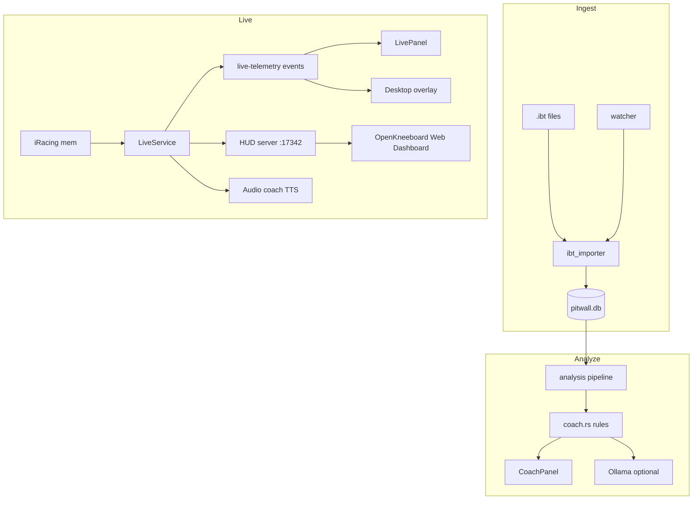

# PitWall Desktop — Architecture & Audit

Last audited: June 22, 2026. Version **0.1.0**.

This document describes how the project is structured, how data flows through it, and what is implemented vs planned.

---

## Overview

PitWall Desktop is a **Tauri 2** application: a Rust backend (`src-tauri/`) exposes IPC commands and events to a **React** frontend (`src/`). Post-session work uses **SQLite**; live work uses the **pitwall** crate's shared-memory connection to iRacing.



---

## Repository layout

```
pitwall-desktop/
├── docs/
│   └── ARCHITECTURE.md          # This file
├── src/                         # React frontend
│   ├── main.tsx                 # Main window entry
│   ├── overlay.tsx              # Overlay window entry
│   ├── App.tsx                  # Analyze | Live tabs
│   ├── components/              # UI panels
│   └── lib/                     # api.ts, types.ts
├── src-tauri/
│   ├── src/                     # Rust modules (see below)
│   ├── capabilities/            # Tauri IPC permissions per window
│   ├── tauri.conf.json
│   └── Cargo.toml               # vr-overlay feature flag
├── index.html                   # Main Vite entry
├── overlay.html                 # Overlay Vite entry
├── vite.config.ts               # Multi-page build
├── setup.ps1                    # First-run setup script
└── package.json
```

---

## Rust backend modules

| Module | Path | Responsibility |
|--------|------|----------------|
| `commands` | `commands/mod.rs` | `AppState`, all Tauri IPC handlers |
| `ingest` | `ingest/` | IBT import, watcher, `app.ini` check |
| `analysis` | `analysis/` | Lap segmentation, sectors, fuel/tire, coach rules |
| `storage` | `storage/` | SQLite schema, models, queries |
| `live` | `live/` | `LiveService`, snapshots, sector tracking, competitor leaderboard, pack state, standings persistence |
| `coach` | `coach/` | Ollama HTTP client for AI summaries |
| `settings` | `settings/` | `settings.json` load/save |
| `overlay` | `overlay/` | Desktop `live-overlay` Tauri window |
| `vr` | `vr/` | In-headset HUD via local HTTP server (OpenKneeboard / OpenXR) |
| `audio` | `audio/` | TTS audio coach from live snapshot |

### Ingest pipeline

1. **Watcher** (`watcher.rs`) — `notify` on `Documents/iRacing/telemetry/`, `Create` events only.
2. **Import runner** (`import_runner.rs`) — single-import mutex, progress events, `spawn_blocking` for DB writes.
3. **IBT importer** (`ibt_importer.rs`) — parses via `pitwall`, SHA256 dedup, calls analysis pipeline.
4. **Frame extractor** (`frame_extractor.rs`) — pre-resolved variable offsets for IBT frames.
5. **Config check** (`config_check.rs`) — validates `irsdkEnableMem`, `irsdkEnableDisk`, telemetry dir.

### Analysis pipeline

1. **Lap segmenter** — splits frames into laps; downsamples trace points for charts.
2. **Sector splitter** — uses iRacing sector boundaries; ignores sector 0 at 0%; always computes S3.
3. **Fuel/tire** — per-lap aggregates.
4. **Coach** (`coach.rs`) — deterministic insights from DB data (see [Coach engine](#coach-engine)).

### Live pipeline

1. `Pitwall::connect().await` — shared memory connection.
2. Subscribe to `AnalysisFrame` at `UpdateRate::Max(10)` (player) **and** `CarIdxFrame` at `UpdateRate::Max(4)` (all cars + session-wide state).
3. `session_updates()` stream — track/car name, sector boundaries, and the driver roster (`competitors::build_roster`) from session YAML.
4. `LiveTracker` — lap boundaries, sector crossings, deltas; holds the cached roster and player car index.
5. `merge_car_idx` — folds the latest `CarIdxFrame` into the snapshot: leaderboard (`competitors.rs`), positions, gaps, session deltas, pack state (`pack.rs`), flags, incidents, fuel/session remain.
6. Per-lap traffic logging — laps run side-by-side (`pack_state.is_traffic()`) are accumulated for the standings snapshot.
7. Emit `live-telemetry` + `live-status` every **100 ms** (10 Hz UI throttle).
8. On disconnect — `persist_standings` writes a `session_standings` row (final field + traffic laps), later linked to an imported IBT by track + recency.

---

## Frontend

### Entry points

| HTML | TS entry | Window |
|------|----------|--------|
| `index.html` | `main.tsx` | Main (`Analyze` / `Live` tabs) |
| `overlay.html` | `overlay.tsx` | `live-overlay` (created at runtime) |

### Components

| Component | Role |
|-----------|------|
| `SessionBrowser` | Session list, import/scan/clear DB |
| `LapTable` | Laps with sectors; select 2 for compare; coach highlight |
| `LapCompareChart` | Speed/throttle/brake traces (Recharts) |
| `FuelTirePanel` | Fuel and tire charts |
| `CoachPanel` | Rule insights (incl. field pace / traffic) + Ollama summary button |
| `SessionStandingsPanel` | Read-only standings snapshot for the session, when a live snapshot is linked |
| `SessionLeaderboard` | Live leaderboard with overall/class toggle |
| `ConfigBanner` | `app.ini` warnings; "Start live monitor" CTA |
| `LivePanel` | Live controls, metrics, leaderboard, overlay/VR/audio toggles |
| `OverlayView` | Minimal HUD for pop-out window |

### API layer (`src/lib/api.ts`)

- `invoke()` wrappers for every Tauri command.
- Event listeners: `onImportComplete`, `onImportStatus`, `onLiveTelemetry`, `onLiveStatus`.
- Format helpers: `formatLapTime`, `formatDelta`, `formatDate`.

TypeScript types in `src/lib/types.ts` mirror Rust `serde` structs (`camelCase`).

---

## IPC reference

### Commands (29)

| Command | Input | Output | Notes |
|---------|-------|--------|-------|
| `list_sessions` | — | `SessionSummary[]` | Newest first |
| `get_session` | `session_id` | `SessionDetail?` | Laps + sectors |
| `get_lap_traces` | `lap_ids[]` | `LapTrace[]` | For compare chart |
| `get_fuel_summary` | `session_id` | `FuelSummary` | |
| `get_tire_summary` | `session_id` | `TireSummary` | |
| `import_ibt` | `path` | `String` | Status message |
| `import_folder_cmd` | — | `usize` | Count imported |
| `check_iracing_config_cmd` | — | `IracingConfigCheck` | |
| `get_import_status` | — | `ImportStatus` | |
| `pick_ibt_file` | — | `String?` | Native dialog |
| `clear_database_cmd` | — | `usize` | **Debug builds only** |
| `start_live_monitor` | — | — | May auto-start VR/audio per settings |
| `stop_live_monitor` | — | — | Stops live, VR, audio |
| `get_live_status` | — | `LiveStatus` | |
| `get_live_snapshot` | — | `LiveSnapshot` | |
| `get_coach_report` | `session_id` | `CoachReport` | Rule engine; adds field/traffic insights when standings linked |
| `get_session_standings` | `session_id` | `SessionStandings?` | Linked live standings snapshot |
| `generate_coach_summary` | `session_id` | `CoachSummaryResult` | Ollama |
| `get_settings` | — | `AppSettings` | |
| `save_settings_cmd` | `settings` | — | |
| `open_desktop_overlay_cmd` | — | — | |
| `close_desktop_overlay_cmd` | — | — | |
| `is_desktop_overlay_open_cmd` | — | `bool` | |
| `start_vr_overlay` | — | — | Requires live monitor |
| `stop_vr_overlay` | — | — | |
| `get_vr_overlay_status` | — | `VrOverlayStatus` | |
| `start_audio_coach` | — | — | Requires live monitor |
| `stop_audio_coach` | — | — | |
| `get_audio_coach_status` | — | `AudioCoachStatus` | Active + last message |
| `get_audio_coach_message` | — | `String` | Last TTS message |

### Events (4)

| Event | Payload | Rate / trigger |
|-------|---------|----------------|
| `import-status` | `ImportStatus` | During import |
| `import-complete` | `session_id: i64` | Import success |
| `live-telemetry` | `LiveSnapshot` | ~10 Hz while connected |
| `live-status` | `LiveStatus` | ~10 Hz while connected |

### Tauri capabilities

| File | Windows | Permissions |
|------|---------|-------------|
| `capabilities/default.json` | `main` | `core:default`, `dialog:default` |
| `capabilities/overlay.json` | `live-overlay` | `core:default` |

---

## Data model

### SQLite — `%LOCALAPPDATA%\pitwall-desktop\pitwall.db`

**PRAGMA:** `journal_mode=WAL`, `synchronous=NORMAL`

#### `sessions`

| Column | Type | Notes |
|--------|------|-------|
| `id` | INTEGER PK | |
| `ibt_path` | TEXT UNIQUE | Full path to source IBT |
| `file_hash` | TEXT | SHA256 for dedup |
| `track`, `car` | TEXT | From session YAML |
| `session_date` | TEXT | ISO |
| `lap_count` | INTEGER | |
| `best_lap_ms` | REAL | |
| `imported_at` | TEXT | ISO |

#### `laps`

| Column | Type | Notes |
|--------|------|-------|
| `id` | INTEGER PK | |
| `session_id` | FK → sessions | CASCADE delete |
| `session_num` | INTEGER | iRacing sub-session (P/Q/R) |
| `session_type` | TEXT | e.g. "PRACTICE" |
| `iracing_lap` | INTEGER | Raw iRacing lap counter |
| `lap_number` | INTEGER | Sequential within sub-session |
| `lap_time_ms` | REAL | |
| `valid` | INTEGER | 0/1 |
| `fuel_start`, `fuel_used` | REAL | |
| `avg_speed` | REAL | |
| `lf_temp`, `rf_temp`, `lr_temp`, `rr_temp` | REAL | Lap averages |

**UNIQUE:** `(session_id, session_num, lap_number)`

#### `sectors`

| Column | Type |
|--------|------|
| `lap_id` | FK → laps |
| `sector_num` | INTEGER (1–3) |
| `time_ms` | REAL |

**UNIQUE:** `(lap_id, sector_num)`

#### `lap_traces`

Downsampled points for compare chart: `dist_pct`, `speed`, `throttle`, `brake`, `gear`, `steering`.

#### `session_standings`

Post-session snapshot of the live field, captured on live disconnect and linked to an imported IBT by track + recency.

| Column | Type | Notes |
|--------|------|-------|
| `id` | INTEGER PK | |
| `session_id` | FK → sessions | Nullable; `ON DELETE SET NULL` |
| `track`, `session_type`, `session_date` | TEXT | |
| `session_fastest_ms`, `player_best_ms` | REAL | |
| `player_position`, `player_class_position` | INTEGER | |
| `competitors_json` | TEXT | Leaderboard rows (position, best lap, class) |
| `traffic_laps_json` | TEXT | iRacing lap numbers run side-by-side |
| `created_at` | TEXT | ISO |

### Settings — `%LOCALAPPDATA%\pitwall-desktop\settings.json`

```json
{
  "ollamaUrl": "http://localhost:11434",
  "ollamaModel": "llama3.2",
  "overlayX": 100,
  "overlayY": 100,
  "overlayWidth": 320,
  "overlayHeight": 180,
  "vrOverlayEnabled": false,
  "vrOverlayScale": 1.0,
  "audioCoachEnabled": true,
  "audioCoachFuelThreshold": 5.0,
  "audioPackAlertsEnabled": true,
  "audioFlagsEnabled": true,
  "audioIncidentsEnabled": true,
  "audioFuelRaceEnabled": true
}
```

---

## Coach engine

Rule-based insights (`analysis/coach.rs`) — no GPU, runs on imported SQLite data:

| Insight kind | Logic |
|--------------|-------|
| `consistency` | Std dev of valid lap times |
| `sector_weakness` | Per sub-session: avg sector loss vs best lap (>50 ms), per S1–S3 |
| `fuel` | Last lap fuel > 115% of session average |
| `session_pace` | Your best lap vs the session's fastest (from a linked standings snapshot) |
| `traffic_pace` | Slow laps (>500 ms off best) that were also run in traffic |

**Not yet implemented** (listed in v2 plan but absent from code):

- Throttle/brake anomaly detection from trace compare
- Per-stage consistency breakdown (uses all valid laps globally)

### Ollama layer (`coach/llm.rs`)

Sends a text prompt with lap stats + insight bullets — **not** raw IBT. POST to `{ollamaUrl}/api/generate`. Fails gracefully if Ollama is offline.

---

## Overlay architecture

### Desktop (Phase 3A)

- Tauri `WebviewWindowBuilder` → label `live-overlay`, `overlay.html`.
- Always-on-top, transparent, undecorated.
- Subscribes to `live-telemetry` events (same as Live panel).
- Position/size from `settings.json`; **persisted on close** via `overlay/desktop.rs` window event handler.

### VR / in-headset (Phase 3B)

RaceLab and similar tools inject HUDs through **OpenXR** — not SteamVR. PitWall uses the same pattern as iOverlay + OpenKneeboard:

- Local HTTP server on `http://127.0.0.1:17342/vr` (`vr/hud_server.rs`)
- Serves a self-contained HTML HUD that polls `/api/live` at 10 Hz
- User adds the URL as a **Web Dashboard** tab in [OpenKneeboard](https://openkneeboard.com/)
- Works with iRacing in **OpenXR** mode — no SteamVR, no CMake, no OpenVR SDK

**HUD content:** track, session type, car, position (class · overall), gap ahead/behind, spotter pack indicator, lap time, Δ best, Δ last, Δ field (session best), best lap, fuel, speed, sector progress bars, tire temps (LF/RF/LR/RR).

**Why not native OpenXR injection?** See [VR_NATIVE_SPIKE.md](VR_NATIVE_SPIKE.md). Spike decision (June 2026): **no-go** on a PitWall-native OpenXR API layer for now. `XR_EXTX_overlay` is unsupported on consumer runtimes; the only native path is the same `xrEndFrame` API-layer hooking OpenKneeboard already does. OpenKneeboard + web HUD remains the official workflow.

### Audio coach (Phase 3C)

Implemented in `audio/coach.rs` + `audio/mod.rs`:

- Windows TTS via `tts` crate; polls live snapshot every **250 ms**
- **Priority model** — at most one alert per tick, highest priority wins; lower-priority alerts are deferred (not dropped). Order: Critical (red/checkered) → Safety (yellow/green/blue/incident) → Pack → Race (fuel) → Pace (sector/lap)
- **Pit/off-track suppression** — Pack/Race/Pace alerts are muted on pit road or when off track; flags and incidents still announce
- **Session intro** — track and session type when telemetry connects
- **Flags** — edge-triggered yellow, green, blue ("faster car"), checkered, red, white
- **Incidents** — announced when `PlayerCarMyIncidentCount` increases
- **Spotter pack** — car left/right, three-wide, two cars left/right (`CarLeftRight`), 4 s cooldown
- **Sector complete** — time, delta vs personal-best sector, live pace hint
- **Lap complete** — lap time, PB callout, delta to best/previous lap, class position, fuel + laps remaining estimate
- **Fuel** — low-fuel threshold (`audioCoachFuelThreshold`, default 5 L) and race fuel-to-finish calls from `SessionLapsRemain`
- Per-category toggles: `audioPackAlertsEnabled`, `audioFlagsEnabled`, `audioIncidentsEnabled`, `audioFuelRaceEnabled`
- Commands: `start_audio_coach`, `stop_audio_coach`, `get_audio_coach_status`, `get_audio_coach_message`
- Auto-start when `audioCoachEnabled` is true and live monitor starts

---

## Build configuration

### Cargo features

No optional features required for VR HUD — the HTTP server is always compiled.

### Vite (`vite.config.ts`)

- Dev server port **1420** (strict).
- Multi-page: `index.html` + `overlay.html`.
- Ignores `src-tauri/**` from file watching.

### Key dependencies

| Crate / package | Role |
|-----------------|------|
| `pitwall` 0.1 | IBT + live SDK |
| `rayon` | Parallel analysis |
| `rusqlite` | SQLite |
| `notify` | File watcher |
| `reqwest` | Ollama |
| `openvr` | Removed — required SteamVR |
| `tts` | Audio coach |
| `recharts` | Frontend charts |

---

## Audit findings

### Implemented (v2 plan)

| Item | Status |
|------|--------|
| Live panel + 10 Hz events | Done |
| `start/stop_live_monitor` | Done |
| Rule-based coach + UI | Done |
| Ollama summary | Done |
| Desktop overlay | Done |
| VR in-headset HUD | Done (OpenKneeboard web URL, no SteamVR) |
| Audio TTS coach | Done |
| Config banner live CTA | Done |
| Sub-session lap segmentation | Done (v1 fix) |
| Sector splitter fix | Done (v1 fix) |

### Implemented (v3 roadmap)

| Item | Status |
|------|--------|
| Trace-based coach (`trace_coach.rs`) | Done — early lift, late brake, high steering |
| Live reconnect + backoff | Done — `Reconnecting` state |
| Post-session IBT import on live disconnect | Done — scans last 10 min |
| GitHub Actions CI | Done — `.github/workflows/ci.yml` |
| Overlay position persist on close | Done |
| App version in header | Done |
| VR native spike doc | Done — [VR_NATIVE_SPIKE.md](VR_NATIVE_SPIKE.md), no-go on native layer |

### Implemented (v4 — multi-driver comparison)

| Item | Status |
|------|--------|
| Live leaderboard (overall/class) | Done — `competitors.rs`, `SessionLeaderboard.tsx` |
| Session best/optimal deltas | Done — `LapDeltaToSessionBestLap` / `…OptimalLap` |
| Gaps ahead/behind | Done — `CarIdxF2Time` differences (validate vs live) |
| Spotter pack state | Done — `pack.rs` from `CarLeftRight` |
| VR HUD field context | Done — position, gaps, field delta, pack line |
| Audio priority queue + suppression | Done — `audio/coach.rs` |
| Flags / incidents / race-fuel audio | Done — edge-triggered, per-category toggles |
| Standings snapshot on disconnect | Done — `session_standings` table, IBT link |
| `session_pace` / `traffic_pace` coach | Done — `analysis/coach.rs` |
| Post-session standings UI | Done — `SessionStandingsPanel.tsx` |
| Multi-driver docs | Done — [COMPARISON.md](COMPARISON.md) |

### Gaps / limitations

| Item | Detail |
|------|--------|
| Native OpenXR API layer | Researched; **deferred** — see VR_NATIVE_SPIKE.md |
| OpenVR / SteamVR path | Removed — user request |
| OpenKneeboard required for VR | By design; PitWall serves URL only |
| MoTeC export | Out of scope, not started |
| Multi-car analysis | Out of scope, not started |
| Real-time LLM coaching | Out of scope |
| `clear_database_cmd` | Debug builds only |
| Single import at a time | `import_gate` mutex |
| Lap compare | UI limited to 2 laps |
| Tire wear | Note in UI: wear updates on pit for some cars |
| Tauri icons | `tauri.conf.json` references `icons/`; folder may be empty |

### Operational prerequisites

1. **`app.ini`** — `irsdkEnableDisk=1` for IBT; `irsdkEnableMem=1` for live.
2. **Telemetry folder** — `Documents\iRacing\telemetry\`.
3. **Ollama** — running locally for AI summaries.
4. **OpenKneeboard** — for in-headset HUD URL tab (optional).

---

## Suggested reading order for new contributors

1. `src-tauri/src/lib.rs` — module registration, invoke handler
2. `src-tauri/src/commands/mod.rs` — `AppState` and command surface
3. `src-tauri/src/ingest/import_runner.rs` — import flow + events
4. `src-tauri/src/analysis/pipeline.rs` — post-session analysis
5. `src-tauri/src/live/mod.rs` — live telemetry loop
6. `src/App.tsx` + `src/lib/api.ts` — frontend wiring
