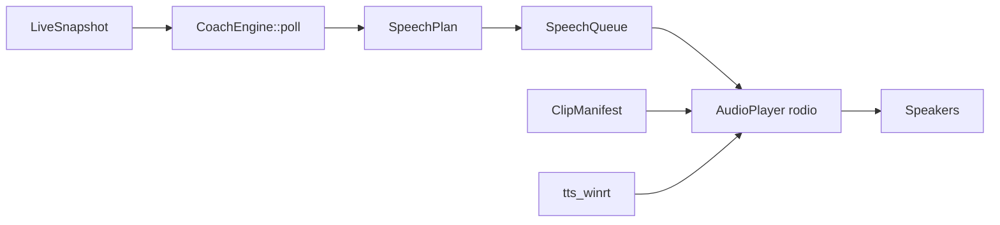

# Audio coach (Path B)

The live audio coach speaks race-engineer callouts while you drive. **Runtime policy:** pre-recorded WAV clips for fixed phrases plus **Windows WinRT TTS** for dynamic numbers (lap times, gaps, positions). No neural models or ONNX run while iRacing is open.

---

## Pipeline



| Module | Role |
|--------|------|
| `audio/coach.rs` | Priority logic, edge detection, session modes |
| `audio/speech.rs` | `SpeechPlan` / `SpeechUnit` (clip, TTS, sequence) |
| `audio/queue.rs` | Serializes playback; one line at a time |
| `audio/player.rs` | rodio WAV playback + WinRT synthesis |
| `audio/manifest.rs` | Maps clip keys → WAV paths |
| `audio/clip_phrases.rs` | Static phrase keys |
| `audio/phrasing.rs` | Number/time formatting for TTS |
| `audio/session_mode.rs` | Practice / qual / race behavior |
| `audio/mod.rs` | `AudioCoachService` — 250 ms poll loop |

Clips ship in `src-tauri/resources/audio/coach/default/` (`manifest.json` + `*.wav`).

---

## Speech plans

- **Clip only** — flags, pack, many fuel phrases (`flag_yellow`, `pack_car_left`, …)
- **TTS only** — rare full-string dynamic lines
- **Sequence** — clip prefix + WinRT numbers (typical lap/sector: `"Lap"` clip + `"1:23.456"` TTS)

Lap and sector callouts use sequences so intonation stays consistent while times stay accurate.

---

## Priority and suppression

At most **one alert per poll** (250 ms). Highest eligible priority wins; lower priorities wait for the next tick (not dropped).

| Priority | Category | Examples |
|----------|----------|----------|
| 1 | Critical | Red, checkered, black |
| 2 | Safety | Yellow (incl. waving), green, blue, incidents |
| 3 | Pack | Car left/right, three-wide, two-wide (4 s cooldown) |
| 4 | Race | Fuel-to-finish, low fuel, pit-this-lap |
| 5 | Pace | Sector/lap summaries, gap summaries |
| 6 | Strategy | Race clock, pits open, position changes |

**Pit / off-track suppression:** Pack, race, pace, gap, and strategy alerts are muted on pit road or off track. Flags and incidents still announce.

**Chatter level** (`audioCoachChatterLevel`): `minimal` trims pace/strategy; `verbose` allows more gap and pack-clear callouts.

Per-category toggles in settings: pack, flags, incidents, fuel/race, gaps, pace, strategy, race clock, pits open, pack clear.

---

## Message catalog (summary)

| Area | Triggers | Delivery |
|------|----------|----------|
| Session intro | Telemetry connect | TTS track + session type |
| Flags | `SessionFlags` edges | WAV clips |
| Incidents | `PlayerCarMyIncidentCount` increase | `"Incident"` clip + count TTS |
| Pack | `CarLeftRight` / `pack_state` | WAV clips |
| Sector complete | Sector boundary cross | Sequence: sector # + time + deltas |
| Lap complete | Lap increment | Sequence: lap # + time + PB/delta/position/fuel |
| Gaps | Lap end or threshold cross | Clip + seconds TTS |
| Race fuel | `SessionLapsRemain` vs fuel estimate | WAV + TTS |
| Race clock | Time/lap milestones | WAV clips |
| Pits open | `PitsOpen` edge | WAV clip |
| Position | Class position change at lap end | Clip + position TTS |

Full phrase keys: [`scripts/audio-phrases.txt`](../scripts/audio-phrases.txt).

---

## Session modes

`session_mode.rs` adjusts copy and which alerts fire:

- **Practice** — pace vs personal best emphasized
- **Qualifying** — session-best deltas on sectors
- **Race** — fuel strategy, race clock, pits open, position callouts

Session reset clears coach state when track or session type changes.

---

## Dev clip pipeline

Neural WinRT synthesis runs **only** in the export tool at dev time.

```powershell
.\scripts\generate-audio-clips.ps1 -ListVoices
.\scripts\generate-audio-clips.ps1 -Voice "Jenny"
```

Or via Cargo:

```powershell
cargo run --manifest-path src-tauri\Cargo.toml --bin gen-audio-clips -- --list-voices
cargo run --manifest-path src-tauri\Cargo.toml --bin gen-audio-clips -- --engine winrt
```

1. Edit [`scripts/audio-phrases.txt`](../scripts/audio-phrases.txt) (`key=spoken text`)
2. Run the script — writes `src-tauri/resources/audio/coach/default/*.wav` + `manifest.json`
3. Commit WAVs so release builds bundle your voice
4. Add coach `gather_*` logic in `coach.rs` if it's a new alert type
5. Add a settings toggle if user-configurable

`--engine placeholder` writes silence for CI/layout tests.

---

## How to add a new callout

1. Add phrase key to `audio-phrases.txt` and regenerate clips
2. In `coach.rs`, detect the condition in the appropriate `gather_*` function
3. Return `(SpeechPriority, SpeechPlan)` — use `SpeechPlan::sequence` for clip + numbers
4. Wire a settings toggle in `AppSettings` + LivePanel if needed
5. Document in this file and [COMPARISON.md](COMPARISON.md) if SDK-driven

---

## IPC

| Command | Purpose |
|---------|---------|
| `start_audio_coach` | Start poll loop (requires live monitor) |
| `stop_audio_coach` | Stop queue and player |
| `get_audio_coach_status` | Active flag + last message |
| `get_audio_coach_message` | Last spoken line |

Auto-starts when `audioCoachEnabled` is true and live monitor starts.

See [API.md](API.md) for the full IPC table.
