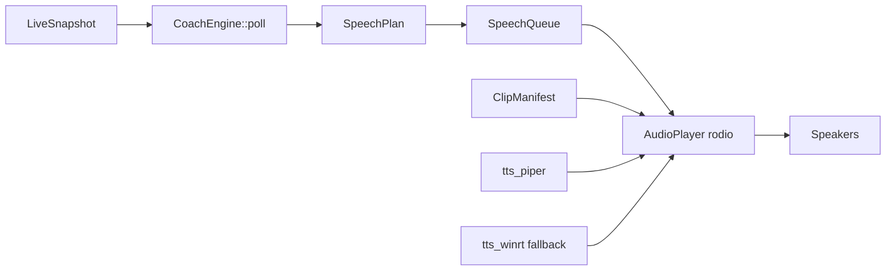

# Audio coach

The live audio coach speaks race-engineer callouts while you drive. **Runtime policy:** fixed phrases are pre-recorded WAV clips, and dynamic numbers (lap times, gaps, deltas, positions) are synthesized live by the **same bundled Piper neural voice** the clips were baked with, so a callout sounds like one speaker. Windows WinRT speech is the fallback when the Piper voice is missing, or when the user picks a Windows voice in Settings.

---

## Pipeline


```mermaid
flowchart LR
  Snap[LiveSnapshot] --> Engine[CoachEngine::poll]
  Engine --> Plan[SpeechPlan]
  Plan --> Queue[SpeechQueue]
  Queue --> Player[AudioPlayer rodio]
  Player --> Speakers[Speakers]
  Manifest[ClipManifest] --> Player
  Piper[tts_piper] --> Player
  WinRT[tts_winrt fallback] --> Player
```

| Module | Role |
|--------|------|
| `audio/engine/` + `rules/*` | Priority logic, edge detection, session modes (`coach.rs` re-exports `RaceEngine`) |
| `audio/speech.rs` | `SpeechPlan` / `SpeechUnit` (clip, TTS, sequence) |
| `audio/queue.rs` | Serializes playback; one line at a time |
| `audio/player.rs` | One rodio sink per plan: clips + synthesized numbers, volume |
| `audio/tts_piper.rs` | Piper (VITS) voice via sherpa-onnx, CPU, in-process |
| `audio/tts_winrt.rs` | Windows speech fallback and voice list |
| `audio/manifest.rs` | Maps clip keys → WAV paths |
| `audio/clip_phrases.rs` | Phrase file loader for clip export |
| `audio/phrasing.rs` | Number/time formatting for TTS |
| `audio/session_mode.rs` | Practice / qual / race behavior |
| `audio/mod.rs` | `AudioCoachService` — 250 ms poll loop |

Clips ship in `src-tauri/resources/audio/coach/default/` (`manifest.json` + `*.wav`) and are bundled via `bundle.resources` in `tauri.conf.json`. At startup the host passes the resolved folder (Tauri resource dir in a packaged build, the `src-tauri` tree under `tauri dev`) to `AudioCoachService::set_clips_dir`. If no `manifest.json` is found, the coach logs a warning and continues TTS-only; clip callouts are skipped.

### Voice

The Piper voice lives in `src-tauri/resources/audio/coach/piper/` (`*.onnx`, `tokens.txt`, `espeak-ng-data/`, about 78 MB). It is **not committed**: run `scripts/fetch-piper-voice.ps1` once per checkout; the release CI job runs it before `tauri build`, and the folder is bundled like the clips (`AudioCoachService::set_voice_dir`). The default is `en_US-norman-medium`, trained on public-domain LibriVox audio. Do not swap in Lessac-derived Piper voices (`lessac`, `ryan`, `amy`, `joe`, `hfc_*`, …): their training data is research-only or non-commercial.

The voice loads once per app session (about 1 s) on the coach thread and synthesizes roughly 15× faster than real time on two CPU threads, so it stays light next to the sim. A plan's units are appended to one sink in order, so the next number is synthesized while the radio beep and clip before it are already playing. Piper output and baked clips are trimmed to 40 ms of edge padding so chained units flow.

`audioCoachVoice` empty (the default, "Race Refinery voice") selects Piper; a Windows voice name routes numbers through WinRT instead. `audioCoachRate` maps to Piper speed and WinRT speaking rate; `audioCoachVolume` is applied on the sink. If Piper fails to load or synthesize, numbers fall back to WinRT and a warning is logged once.

---

## Speech plans

- **Clip only** — flags, pack, many fuel phrases (`flag_yellow`, `pack_car_left`, …)
- **TTS only** — rare full-string dynamic lines
- **Sequence** — clip prefix + live numbers (typical lap: `"Lap"` clip + `"12, 1 23.5"` TTS)

Lap and sector callouts use sequences so intonation stays consistent while times stay accurate. `phrasing.rs` writes numbers the way the Piper phonemizer reads them naturally: lap times in radio cadence (`"1 23.5"` → "one twenty-three point five", `"1 oh 5.3"` for seconds under ten), deltas in tenths under a second (`"1 tenth"`, never `"0 tenths"`), and whole-second gaps without a trailing `.0`.

---

## Priority and suppression

At most **one alert per poll** (250 ms). Highest eligible priority wins; lower priorities wait for the next tick (not dropped).

| Priority | Category | Examples |
|----------|----------|----------|
| 1 | Critical | Red, checkered, black |
| 2 | Safety | Yellow (incl. waving), green, blue, incidents |
| 3 | Pack | Car left/right, three-wide, two-wide (4 s cooldown) |
| 4 | Race | Fuel-to-finish, low fuel, pit-this-lap |
| 5 | Pace | Sector/lap summaries, gap summaries |
| 6 | Strategy | Race clock, pits open, position changes |

**Pit / off-track suppression:** Pack, race, pace, gap, and strategy alerts are muted on pit road or off track. Flags and incidents still announce.

**Chatter level** (`audioCoachChatterLevel`): `minimal` trims pace/strategy; `verbose` allows more gap and pack-clear callouts.

Per-category toggles in settings: pack, flags, incidents, fuel/race, gaps, pace, strategy, race clock, pits open, pack clear.

---

## Message catalog (summary)

| Area | Triggers | Delivery |
|------|----------|----------|
| Session intro | Telemetry connect | TTS track + session type |
| Flags | `SessionFlags` edges | WAV clips |
| Incidents | `PlayerCarMyIncidentCount` increase | `"Incident"` clip + count TTS |
| Pack | `CarLeftRight` / `pack_state` | WAV clips |
| Sector complete | Sector boundary cross | Sequence: sector # + time + deltas |
| Lap complete | Lap increment | Sequence: lap # + time + PB/delta/position/fuel |
| Gaps | Lap end or threshold cross | Clip + seconds TTS |
| Race fuel | `SessionLapsRemain` vs fuel estimate | WAV + TTS |
| Race clock | Time/lap milestones | WAV clips |
| Pits open | `PitsOpen` edge | WAV clip |
| Position | Class position change at lap end | Clip + position TTS |

Full phrase keys: [`scripts/audio-phrases.txt`](../scripts/audio-phrases.txt).

---

## Session modes

`session_mode.rs` adjusts copy and which alerts fire:

- **Practice** — pace vs personal best emphasized
- **Qualifying** — session-best deltas on sectors
- **Race** — fuel strategy, race clock, pits open, position callouts

Session reset clears coach state when track or session type changes.

---

## Dev clip pipeline

Clips are baked with the same Piper voice the app uses live (`--engine piper`, the default). The script fetches the voice first if it is missing.

```powershell
.\scripts\generate-audio-clips.ps1
.\scripts\generate-audio-clips.ps1 -Only tyre_hot,lap_invalid
```

Or via Cargo:

```powershell
cargo run --release --manifest-path src-tauri\Cargo.toml --bin gen-audio-clips
cargo run --manifest-path src-tauri\Cargo.toml --bin gen-audio-clips -- --engine winrt --voice "Guy"
cargo run --manifest-path src-tauri\Cargo.toml --bin gen-audio-clips -- --list-voices
```

1. Edit [`scripts/audio-phrases.txt`](../scripts/audio-phrases.txt) (`key=spoken text`)
2. Run the script — writes `src-tauri/resources/audio/coach/default/*.wav` + `manifest.json`.
   To add clips without re-recording the rest, pass `-Only key1,key2`; other WAVs
   and manifest entries are kept. `radio_beep` is a synthesized chirp, not speech.
3. Commit WAVs so release builds bundle them. If you change the Piper voice, re-bake
   every clip so callouts and live numbers stay one speaker.
4. Add a rule under `audio/engine/rules/` (or extend an existing rule) if it's a new alert type
5. Add a settings toggle if user-configurable

`--engine placeholder` writes silence for CI/layout tests.

---

## How to add a new callout

1. Add phrase key to `audio-phrases.txt` and generate it (`-Only <key>`)
2. Implement detection in `audio/engine/rules/<topic>.rs` and register it in the rule set
3. Return `(SpeechPriority, SpeechPlan)` — use `SpeechPlan::sequence` for clip + numbers
4. Wire a settings toggle in `AppSettings` + `features/live/LivePage.tsx` if needed
5. Document in this file and [COMPARISON.md](COMPARISON.md) if SDK-driven

---

## IPC

| Command | Purpose |
|---------|---------|
| `start_audio_coach` | Start poll loop (requires live monitor) |
| `stop_audio_coach` | Stop queue and player |
| `get_audio_coach_status` | Active flag, last message, `neuralVoice` (Piper installed) |
| `get_audio_coach_message` | Last spoken line |
| `test_audio_coach` | One-shot lap callout (clips + live number) with the saved voice, speed, volume |

Auto-starts when `audioCoachEnabled` is true and live monitor starts.

See [API.md](API.md) for the full IPC table.
